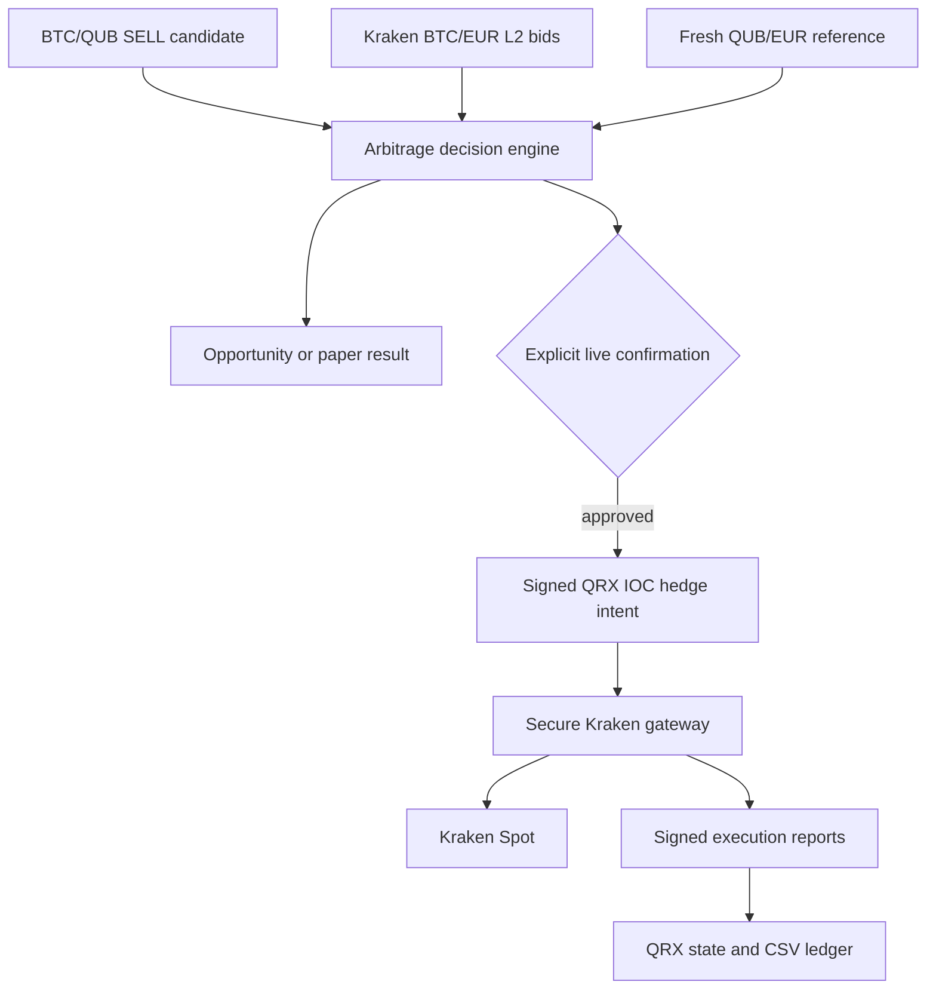

# QRX Core 0.0.7 — VELOCITY Phase 4F.2

## Cross-Venue Arbitrage, Paper Trading & Complete CSV Ledger

Phase 4F.2 adds a deliberately bounded BTC/QUB → Kraken BTC/EUR arbitrage workflow. It does not claim atomic settlement between QRX, Bitcoin and Kraken. The design instead exposes and limits leg, price, liquidity and operational risk.

## Architecture



## Decision model

For quantity `q` BTC, the engine consumes Kraken bid levels until `q` is executable and computes the actual depth-weighted proceeds. It never uses only a top-of-book ticker.

`net profit = executable Kraken proceeds - QRX acquisition cost - Kraken fee - slippage buffer - risk buffer - BTC/QRX fixed costs`

A decision is accepted only when all configured conditions pass:

- fresh Kraken order book;
- fresh positive QUB/EUR reference;
- sufficient executable Kraken bid depth;
- minimum net EUR profit;
- minimum basis-point margin;
- maximum BTC per opportunity;
- rolling 24-hour BTC limit;
- maximum open EUR exposure;
- for live mode, sufficient operator-confirmed prefunded BTC at Kraken.

Pending-confirmation, approved and broadcast live plans reserve daily volume and exposure in the local SQLite state. Re-evaluating the same deterministic opportunity does not double count it.

## Modes

| Mode | Persistent result | Can submit an order? |
|---|---|---:|
| Opportunity | `OPPORTUNITY_DETECTED` or `REJECTED` | No |
| Paper | `PAPER_FILLED` or `REJECTED` | No |
| Confirm | `AWAITING_CONFIRMATION` | Only after an additional wallet confirmation |

There is intentionally no unattended auto-live mode in Phase 4F.2.

## Confirmed live hedge

The live route has multiple independent gates:

1. The opportunity must be profitable under configured costs and limits.
2. The Kraken depth may be at most 60 seconds old when broadcast is requested.
3. The QUB/EUR reference may be at most five minutes old.
4. The wallet must explicitly transition the plan from `AWAITING_CONFIRMATION` to `APPROVED`.
5. The agent must hold both `TRADE_EXTERNAL` and the explicit `ARBITRAGE_CROSS_VENUE` permission. A generic `TRADE` permission does not imply this permission.
6. The source must be the owner's matched BTC/QUB cross-chain BUY order.
7. The Kraken hedge is always a BTC/EUR `SELL LIMIT IOC` order.
8. The gateway adds a short Kraken request deadline and retains deterministic `cl_ord_id` reconciliation.
9. The wallet signs the QRX transaction in a temporary file, broadcasts the signed file, removes both temporary transaction files and links the broadcast reference to the arbitrage ledger.

The separate permission is important: an ordinary external-trading agent cannot silently become an arbitrage agent.

## Remaining economic risk

Cross-venue arbitrage is not risk-free:

- the cross-chain leg and Kraken leg are not atomic;
- an IOC order can fill partially;
- Bitcoin confirmation/reorg risk remains until the configured SPV threshold is reached;
- the QUB/EUR reference can differ from a realizable market price;
- fees, minimum order sizes and latency can change;
- if the cross-chain purchase fails after prefunded BTC was sold, inventory must be restored.

For that reason the wallet defaults to paper mode and live mode requires prefunded BTC plus explicit confirmation. Small limits should be used until the entire operational flow has been tested with real exchange credentials.

## Complete CSV Ledger

The wallet writes seven UTF-8-with-BOM files plus a checksum manifest:

1. `transactions.csv`
2. `orders.csv`
3. `trades.csv`
4. `crosschain_swaps.csv`
5. `kraken_executions.csv`
6. `arbitrage_report.csv`
7. `complete_ledger.csv`
8. `manifest.json`

The Germany profile uses semicolons and decimal commas. The international profile uses commas and decimal points. String cells that could be interpreted as spreadsheet formulas are neutralized, while negative numeric amounts remain numeric.

The exporter queries every wallet address, requests its complete transaction history, deduplicates transactions, exports all orders and swaps, and requests up to one million trades. The manifest contains row counts and SHA-256 hashes. If any QRX source command fails or returns invalid JSON, the export remains available for diagnosis but the manifest says `complete: false` and lists `source_warnings`.

No API secret, wallet passphrase, private signing key or encrypted Kraken vault content is exported.

## Main implementation files

- `qrx-core/gateways/qrx-arbitrage-engine.py`
- `qrx-core/gateways/qrx-gateway-kraken.py`
- `qrx-core/tools/qrx-complete-ledger-export.py`
- `qrx-core/src/qrx.c`
- `qrx-core/src/qrxd.c`
- `qrx-core/src/qrx_cli.c`
- `GUIWALLET/src-tauri/src/main.rs`
- `GUIWALLET/src/index.html`

## CLI surface

```text
qrx-cli createarbitragehedgetransaction \
  <agent> <owner> <matched_crosschain_buy_order_id> <arbitrage_id> \
  <quantity_sats> <limit_price_atoms> <order_expiry_height> \
  <agent_ed_pub_hex> <agent_mldsa65_pub_b64> <lane_id> \
  <tx_expiry_height> [fee] [nonce]
```

This creates an unsigned QRX `EXTERNAL_ORDER`. The wallet signs it using the selected agent wallet and then broadcasts the signed transaction file.

